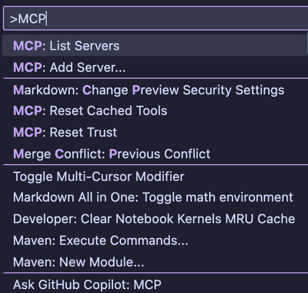
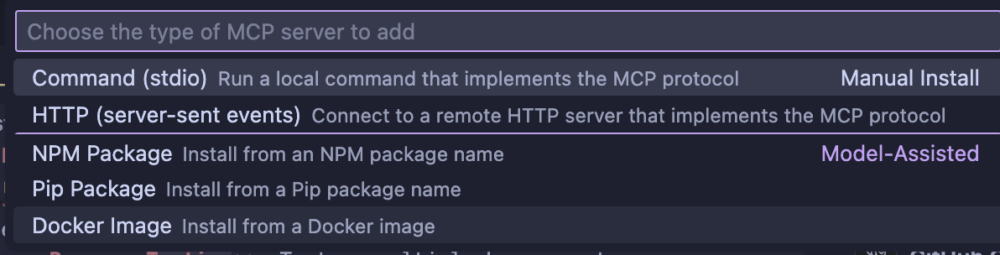
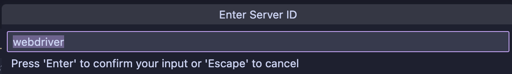
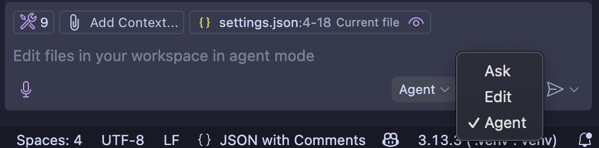
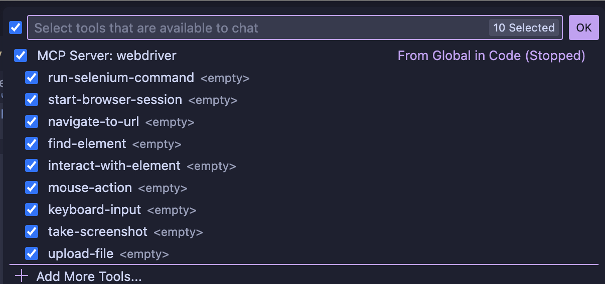

# WebDriver Agent with Visual Studio Code

This guide explains how to set up and use the WebDriver agent.

# Building the Project

## Prerequisites

1. **Node.js and npm**: Ensure you have Node.js and npm installed on your system. You can download them from [Node.js official website](https://nodejs.org/).
2. **Visual Studio Code**: Install Visual Studio Code from [VS Code official website](https://code.visualstudio.com/).
3. **Docker**: If you plan to use Docker, ensure it is installed and running on your system. You can download it from [Docker official website](https://www.docker.com/).

## Setup Instructions

1. **Clone the Repository**:
   ```bash
   git clone https://github.com/omarortega87/mpc-selenium-webdriver.git
   cd mcp-selenium-webdriver
   ```

2. **Install Dependencies**:
   Run the following command to install the required dependencies:
   ```bash
   npm install
   ```

3. **Build the Project**:
   If you are using TypeScript, compile the project using:
   ```bash
   npm run build
   ```

4. **Run the WebDriver Agent**:
   Start the WebDriver agent using:
   ```bash
   npm start
   ```

## WebDriver actions available

The MCP server provides the following WebDriver Actions for interacting with Selenium WebDriver:

### 1. Fetch WebDriver Session Details
   - **Resource**: `webdriver-session`
   - **Description**: Provides details about the Selenium WebDriver session. This is a placeholder for session details logic and can be extended to include more information about the active WebDriver session.

### 2. Run Selenium Commands
   - **Tool**: `run-selenium-command`
   - **Description**: Executes Selenium WebDriver commands. Supported commands include:
     - `navigate`: Navigates to a specified URL.
     - `findElement`: Finds an element using a specified locator strategy (e.g., `id`, `className`, `xpath`, `css`).

### 3. Start Browser Sessions
   - **Tool**: `start-browser-session`
   - **Description**: Starts a new browser session with customizable options. You can specify the browser type (e.g., Chrome, Firefox) and whether to run in headless mode.

### 4. Navigate to URLs
   - **Tool**: `navigate-to-url`
   - **Description**: Navigates the browser to a specified URL.

### 5. Find Elements
   - **Tool**: `find-element`
   - **Description**: Finds elements on a web page using various locator strategies (e.g., `id`, `className`, `xpath`, `css`).

### 6. Interact with Elements
   - **Tool**: `interact-with-element`
   - **Description**: Performs actions on web elements, such as clicking or typing text.

### 7. Perform Mouse Actions
   - **Tool**: `mouse-action`
   - **Description**: Executes mouse actions like hovering or drag-and-drop.

### 8. Send Keyboard Input
   - **Tool**: `keyboard-input`
   - **Description**: Sends keyboard input to the browser, such as pressing keys like `ENTER` or `TAB`.

### 9. Take Screenshots
   - **Tool**: `take-screenshot`
   - **Description**: Captures a screenshot of the current browser view and saves it to a specified file.

### 10. Upload Files
   - **Tool**: `upload-file`
   - **Description**: Uploads a file to a web element (e.g., file input field).

## Running with Docker

1. **Build the Docker Image**:
   ```bash
   docker build -t webdriver-agent .
   ```

2. **Run the Docker Container**:
   ```bash
   docker run -p 4444:4444 webdriver-agent
   ```

## Using Visual Studio Code Agent Mode

Visual Studio Code Agent Mode allows you to interact with the MCP server directly from the editor. Follow these steps to enable and use this feature:

1. **Activate MCP Agent Mode**
   - Open the Command Palette in Visual Studio Code (Ctrl+Shift+P or Cmd+Shift+P on macOS).
   - Search for "MCP, the MCP options most be listed:
   

2. **Add the MCP Server**:
    - Click on *MCP: Add Server...* option
    - VSCode provides several ways to add MCP agents:
    - 
    - Select *Docker Image* option
    - Enter the docker image: **omarortega87/mpc-webdriver**
    - Select *Allow*
    - Add the MCP ID (this is auto populated):
    - 
    - Select *User Settings*
    - VSCode will add the necessary user settings that are available from the Docker Image
    ```json
     "mcp": {
        "servers": {
            "webdriver": {
                "command": "docker",
                "args": [
                    "run",
                    "-i",
                    "--rm",
                    "omarortega87/mpc-webdriver"
                ],
                "env": {},
                "type": "stdio"
            }
        }
    }
    ```
    - Open Gitbub Copilot and select the *Agent Mode* option:
    - 
    - A new icon will be displayed referring to the *mcp-webdriver* agent
    - VSCode will display all the available actions by clicking on the *tools* icon:
    - 

**Now you can start sending instructions to Github Copilot**

Feel free to reach out if you encounter any issues or have questions about the setup.